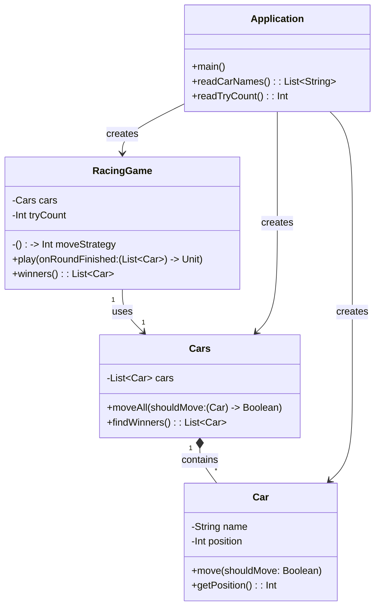

# 🏎️ Kotlin 자동차 경주 게임

프리코스 자동차 경주 미션을 Kotlin으로 재구현한 프로젝트입니다. TDD(Test-Driven Development)와 객체지향 설계를 강화하여 구현했습니다.

## 📋 프로젝트 소개

이 프로젝트는 우아한테크코스 프리코스의 자동차 경주 미션을 Kotlin으로 재구현한 것입니다. Java 버전과의 차이점을 비교하며, Kotlin의 언어적 특성(data class, 불변성, 람다, 고차 함수 등)을 활용하여 더 간결하고 표현력 있는 코드를 작성하는 것을 목표로 합니다.

## 🛠️ 기술 스택

- **언어**: Kotlin 1.9.20
- **빌드 도구**: Gradle (Kotlin DSL)
- **테스트 프레임워크**: JUnit 5
- **테스트 라이브러리**: AssertJ
- **JDK**: 17

## ✨ 기능 목록

### 1. 자동차 이름 입력
- 쉼표(,)로 구분된 자동차 이름을 입력받습니다
- 이름은 1~5자 이내여야 합니다
- 공백 포함 금지
- 중복 이름 금지
- 유효하지 않은 입력 시 예외 처리

### 2. 시도 횟수 입력
- 자연수(1 이상)만 허용
- 숫자가 아니거나 1 미만이면 예외 처리

### 3. 자동차 전진 규칙
- 0~9의 수를 무작위로 생성
- 숫자가 4 이상이면 전진, 아니면 정지
- 전진하면 position이 1 증가

### 4. 경주 진행
- 총 N번의 라운드를 반복
- 각 라운드에서 모든 자동차가 이동 시도를 수행
- 매 라운드 결과를 출력 형식에 맞게 표현

### 5. 경주 결과
- 가장 멀리 간 자동차가 우승자
- 우승자가 여러 명일 경우 쉼표로 구분해 모두 출력

## 🏗️ 클래스 다이어그램

### Mermaid 다이어그램



### 텍스트 다이어그램

```
┌─────────────┐
│    Car      │
├─────────────┤
│ - name      │
│ - position  │
├─────────────┤
│ + move()    │
│ + getPosition()│
└─────────────┘
       ▲
       │
       │ contains
       │
┌─────────────┐
│    Cars     │
├─────────────┤
│ - cars      │
├─────────────┤
│ + moveAll() │
│ + findWinners()│
└─────────────┘
       ▲
       │
       │ uses
       │
┌─────────────┐
│ RacingGame  │
├─────────────┤
│ - cars      │
│ - tryCount  │
│ - moveStrategy│
├─────────────┤
│ + play()    │
│ + winners() │
└─────────────┘
       ▲
       │
       │ creates
       │
┌─────────────┐
│ Application │
├─────────────┤
│ + main()    │
│ + readCarNames()│
│ + readTryCount()│
└─────────────┘
```

## 🚀 실행 방법

### 1. 프로젝트 빌드

```bash
cd kotlin-racingcar
./gradlew build
```

Windows의 경우:
```powershell
cd kotlin-racingcar
.\gradlew.bat build
```

### 2. 애플리케이션 실행

```bash
./gradlew run
```

Windows의 경우:
```powershell
.\gradlew.bat run
```

### 3. 실행 예시

```
경주할 자동차 이름을 입력하세요.(이름은 쉼표(,) 기준으로 구분)
pobi,woni,jun
시도할 회수는 몇회인가요?
5

실행 결과
pobi : --
woni : ---
jun : ----

최종 우승자 : jun
```

## 🧪 테스트 실행 방법

### 전체 테스트 실행

```bash
./gradlew test
```

Windows의 경우:
```powershell
.\gradlew.bat test
```

### 테스트 리포트 확인

테스트 실행 후 리포트는 다음 경로에서 확인할 수 있습니다:
```
build/reports/tests/test/index.html
```

### 개별 테스트 클래스 실행

```bash
./gradlew test --tests CarTest
./gradlew test --tests CarsTest
./gradlew test --tests RacingGameTest
```

## 📊 Java 버전과의 비교

### 1. Kotlin의 장점

#### Data Class 활용
- Java에서는 getter/setter, equals, hashCode, toString을 직접 작성해야 했지만, Kotlin의 data class를 활용하면 더 간결하게 표현 가능

#### 불변성 강조
- `val` 키워드로 불변 속성 선언
- `require()` 함수로 초기화 시점에 유효성 검증

#### 고차 함수와 람다
- `moveAll(shouldMove: (Car) -> Boolean)` 같은 고차 함수로 전략 패턴을 더 간결하게 표현
- `forEach`, `map`, `filter` 등 컬렉션 함수 활용

#### Null 안전성
- `?.` 안전 호출 연산자로 NullPointerException 방지
- `?:` 엘비스 연산자로 기본값 제공

#### 확장 함수
- 필요 시 확장 함수로 기능을 확장할 수 있는 유연성

### 2. 코드 비교 예시

#### Java vs Kotlin

**Java:**
```java
public class Car {
    private final String name;
    private int position;
    
    public Car(String name, int position) {
        if (name == null || name.length() < 1 || name.length() > 5) {
            throw new IllegalArgumentException("...");
        }
        this.name = name;
        this.position = position;
    }
    
    public void move(boolean shouldMove) {
        if (shouldMove) {
            position++;
        }
    }
}
```

**Kotlin:**
```kotlin
class Car(
    val name: String,
    var position: Int = 0
) {
    init {
        require(name.length in 1..5) { "..." }
    }
    
    fun move(shouldMove: Boolean) {
        if (shouldMove) position++
    }
}
```

## 📁 프로젝트 구조

```
kotlin-racingcar/
├── build.gradle.kts          # Gradle 빌드 설정
├── settings.gradle.kts        # Gradle 프로젝트 설정
├── README.md                  # 프로젝트 문서
├── docs/
│   └── mission-plan.md       # 회고 문서
└── src/
    ├── main/kotlin/racingcar/
    │   ├── Application.kt     # 메인 진입점 및 입출력
    │   ├── Car.kt             # 자동차 도메인 모델
    │   ├── Cars.kt            # 자동차 컬렉션
    │   └── RacingGame.kt      # 경주 게임 로직
    └── test/kotlin/racingcar/
        ├── CarTest.kt         # Car 테스트
        ├── CarsTest.kt        # Cars 테스트
        └── RacingGameTest.kt  # RacingGame 테스트
```

## 📝 회고

이번 과제를 통해 Java로 작성했던 자동차 경주 게임을 Kotlin으로 재구현하면서, 두 언어의 차이점과 Kotlin의 장점을 직접 체감할 수 있었습니다.

### Kotlin의 간결함과 표현력

가장 인상 깊었던 부분은 Kotlin의 간결함이었습니다. Java에서는 생성자, getter/setter, 유효성 검증 코드를 여러 줄에 걸쳐 작성해야 했지만, Kotlin에서는 `require()` 함수와 범위 연산자(`in 1..5`)를 활용해 훨씬 간결하게 표현할 수 있었습니다. 특히 `cars.maxOfOrNull { it.getPosition() } ?: 0` 같은 표현식은 Java의 Stream API보다 읽기 쉽고 직관적이었습니다.

### TDD 방식의 개발 경험

TDD 방식으로 개발하면서 테스트를 먼저 작성하고 구현하는 과정에서, 설계에 대해 더 깊이 생각하게 되었습니다. 테스트를 작성하면서 "이 메서드는 어떤 역할을 해야 할까?"를 먼저 고민하게 되고, 그 결과 더 명확한 인터페이스와 책임 분리가 이루어졌습니다. 특히 `RacingGame`의 `moveStrategy`를 함수 타입으로 받아 전략 패턴을 구현한 부분은, 테스트에서 고정된 값을 주입할 수 있어 테스트 작성이 훨씬 수월했습니다.

### 고차 함수와 람다의 활용

고차 함수와 람다를 활용한 부분도 새로웠습니다. `moveAll(shouldMove: (Car) -> Boolean)` 같은 고차 함수를 통해 전략을 주입받는 방식이 Java의 인터페이스 기반 전략 패턴보다 더 유연하고 간결하다고 느꼈습니다. 또한 `forEach`, `map`, `filter` 같은 컬렉션 함수들이 내장되어 있어 별도의 Stream API 없이도 함수형 프로그래밍 스타일을 쉽게 적용할 수 있었습니다.

### Null 안전성의 중요성

Null 안전성도 큰 장점이었습니다. `readLine()?.trim() ?: throw IllegalArgumentException("입력이 없습니다")` 같은 코드에서 `?.`와 `?:` 연산자를 활용해 NullPointerException을 컴파일 타임에 방지할 수 있어 안정성이 높아졌습니다. Java에서 자주 발생하던 NullPointerException을 사전에 방지할 수 있다는 점이 매우 인상적이었습니다.

### 어려웠던 점과 배운 점

다만 처음에는 Kotlin의 문법에 익숙하지 않아서, 특히 `it` 키워드나 람다 표현식에서 파라미터를 생략하는 부분에서 헷갈렸습니다. 또한 `position` 프로퍼티와 `getPosition()` 메서드가 JVM 시그니처 충돌을 일으켜 `private`으로 변경해야 했던 것처럼, Kotlin의 프로퍼티와 Java의 getter/setter 간의 차이를 이해하는 데 시간이 걸렸습니다.

### 객체지향 설계의 적용

객체지향 설계 원칙을 적용하면서 단일 책임 원칙(SRP)과 의존성 역전 원칙(DIP)을 실천할 수 있었습니다. 각 클래스가 명확한 책임을 가지고, 고차 함수를 통해 전략을 주입받는 방식으로 테스트 가능성과 유연성을 높일 수 있었습니다.

### 마무리

전체적으로 이번 과제를 통해 Kotlin의 언어적 특성을 직접 경험하고, TDD와 객체지향 설계 원칙을 적용해보는 좋은 기회가 되었습니다. 특히 코드의 간결함과 표현력이 Java보다 뛰어나다는 것을 체감할 수 있어, 앞으로도 Kotlin을 적극 활용하고 싶다는 생각이 들었습니다. 또한 TDD 방식으로 개발하면서 테스트가 설계에 미치는 긍정적인 영향을 직접 경험할 수 있어, 앞으로의 프로젝트에서도 TDD를 지속적으로 적용하고 싶습니다.

